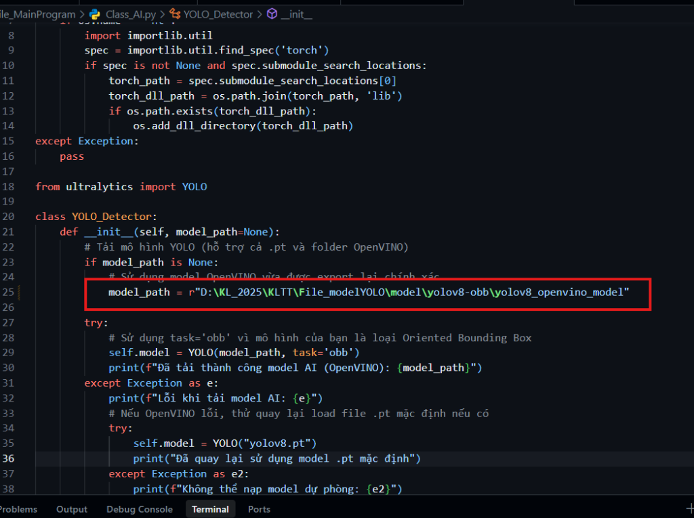

# 🎓 KHÓA LUẬN TỐT NGHIỆP
## Xây dựng hệ thống giám sát và phát hiện vật thể dựa trên thị giác máy tính

---

### 📋 Giới Thiệu
**Đề tài:** Phát hiện lỗi sản phẩm (vỉ thuốc) sử dụng mô hình Deep Learning **YOLO** và tối ưu hóa tốc độ xử lý thời gian thực với **OpenVINO**.

Dự án xây dựng một ứng dụng Desktop hoàn chỉnh giúp tự động hóa quy trình kiểm tra chất lượng sản phẩm thông qua camera.

### 🛠 Công Nghệ Sử Dụng
| Thành phần | Công nghệ |
| :--- | :--- |
| **Ngôn ngữ lập trình** |  |
| **Giao diện người dùng** | **PyQt5** (Thiết kế hiện đại, thân thiện) |
| **Mô hình AI** | **YOLOv8** (Oriented Bounding Box - OBB) |
| **Tăng tốc phần cứng** | **Intel OpenVINO™** |

---

### ⚙️ Hướng Dẫn Cài Đặt & Sử Dụng

#### 1. Tải Model AI (Bắt buộc)
Do kích thước file model (OpenVINO IR) khá lớn nên không được lưu trữ trực tiếp trên Git. Bạn vui lòng tải về từ liên kết dưới đây:

📥 **[Google Drive - Download Model OpenVINO](https://drive.google.com/drive/folders/1GZrhgVkqMVZgJNROqwBPujrJ1-hqv6_k?usp=sharing)**
### ⚠️ Lưu ý quan trọng về OpenVINO & Di chuyển Model

Nếu bạn tự huấn luyện mô hình trên **Google Colab** và muốn mang về máy cá nhân để sử dụng, hãy tuân thủ các quy tắc sau để tránh lỗi xung đột môi trường:

1. **Đồng bộ phiên bản:** Đảm bảo phiên bản thư viện `openvino` và `ultralytics` trên máy cá nhân trùng khớp với phiên bản đã dùng trên Colab.
2. **Quy trình tối ưu (Khuyên dùng):** 
   - Tránh việc tải trực tiếp thư mục OpenVINO đã export từ Colab về máy cá nhân vì có thể gây lỗi tập lệnh CPU (Instruction set mismatch).
   - **Cách tốt nhất:** Chỉ tải file trọng số gốc `.pt` (ví dụ: `best.pt`) về máy cá nhân.
   - Sau đó, thực hiện lệnh xuất (export) sang định dạng OpenVINO ngay trên máy cá nhân để mô hình được tối ưu sâu cho phần cứng hiện tại:
     ```python
     from ultralytics import YOLO
     model = YOLO("path/to/best.pt")
     model.export(format="openvino")
     ```
3. **Cấu hình thư mục:** Khi sử dụng mô hình OpenVINO, bạn phải trỏ đường dẫn đến **nguyên thư mục** chứa đầy đủ các file (`.xml`, `.bin`, và `metadata.yaml`), không được di chuyển hoặc xóa lẻ tẻ các file này.

---
> **Lưu ý:** Đảm bảo Camera/Webcam đã được kết nối trước khi khởi động chức năng nhận diện.

#### 2. Cấu Hình Đường Dẫn
Sau khi tải và giải nén model, mở file `File_MainProgram/Class_AI.py` và cập nhật biến `model_path`:

```python
# Ví dụ:
model_path = r"D:\KL_2025\model\yolov8-obb\yolov8_openvino_model"
```


#### 3. Cài Đặt Thư Viện
Đảm bảo bạn đã kích hoạt môi trường ảo (venv) và cài đặt các dependencies:
```bash
pip install -r requirements.txt
# Hoặc cài trực tiếp:
pip install PyQt5 opencv-python ultralytics openvino
```

#### 4. Chạy Chương Trình
Khởi chạy ứng dụng từ file chính:
```bash
python File_MainProgram/finish.py
```

---

